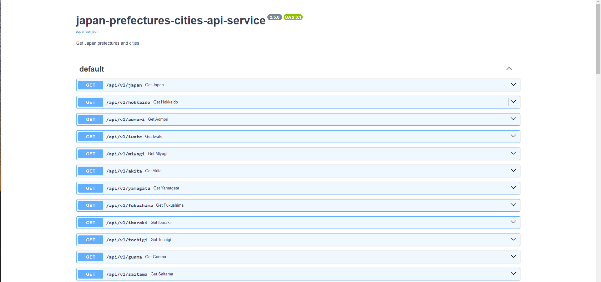

# japan-prefectures-cities-api-service

japan-prefectures-cities-api-service

## Screenshot


```bash
# Clone the repository
git clone https://github.com/mbayeellamine/japan-prefectures-cities-api.py.git

# Change directory to the project folder
cd japan-prefectures-cities-api.py

# Build the Docker image
docker build -t japan-prefectures-cities-api-service .

# Run the Docker container
docker run -p 8000:8000 japan-prefectures-cities-api-service
